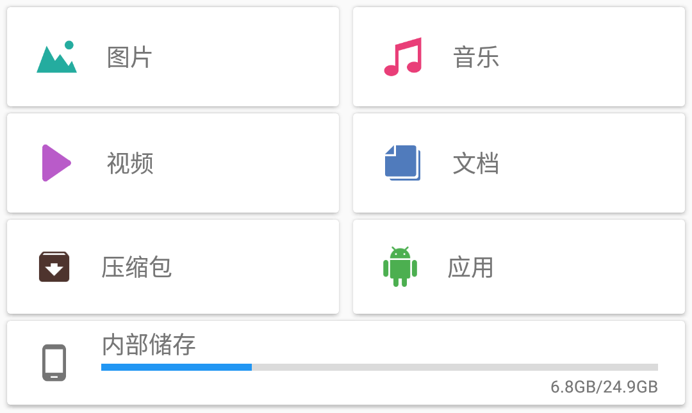
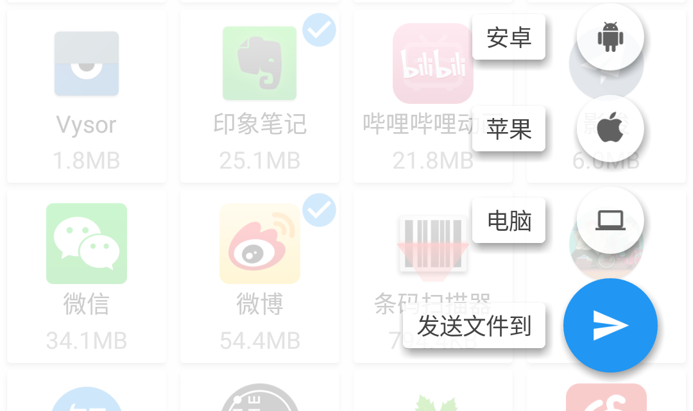
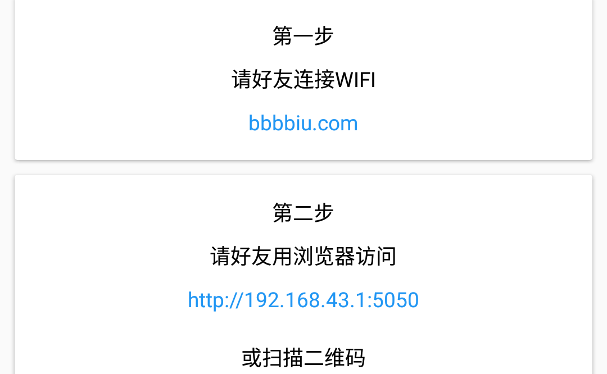
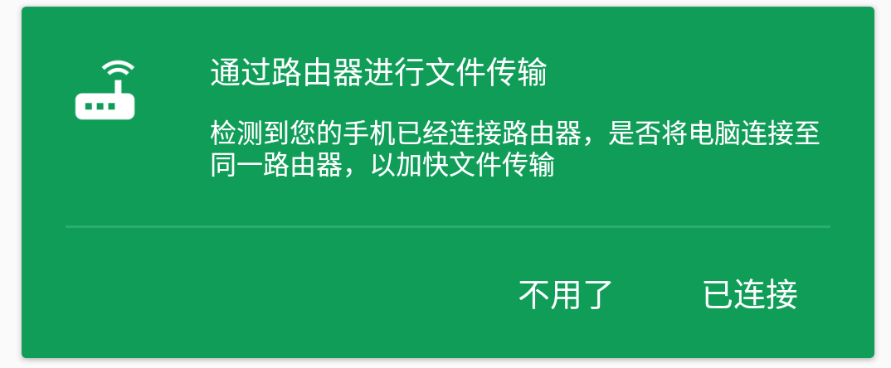
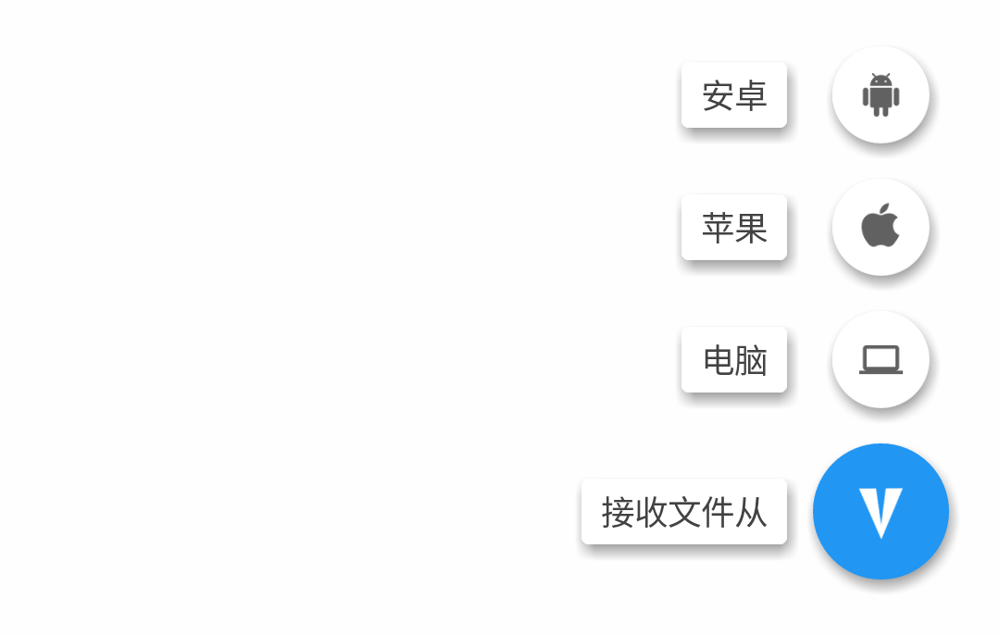
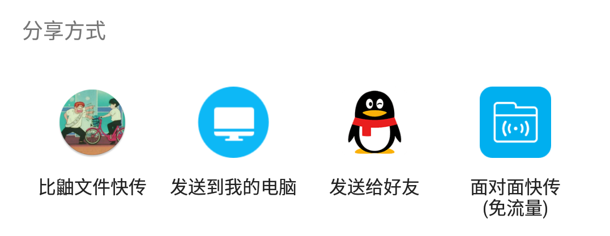

# 使用方法

本应用为Android文件传输应用，实现功能

1. 文件选择
	- 将各类文件分类
	- 提供文件操作的基本功能
2. 文件传输
	- Android与Android设备互传文件
	- Android与PC端互传文件
	- Android与IOS等其他设备互传文件
3. 传输历史
	- 管理传输历史记录：实现打开，删除，发送，分享等操作。
4. 文件分享
	- 接收从其他应用分享的文件，用以发送
	- 将已传输的文件分享给其他应用

## 1.选择文件

可以按文件分类进行选择也可以直接浏览所有文件。

## 2.发送文件

选择文件之后，点击右下角的浮动按钮，选择接收方的设备。

### 2.1发送到安卓

应用会自动开启WIFI热点，等待接收方连接，并自动发送文件。

### 2.2发送到苹果

应用会开启名为bbbbiu.com的WIFI热点，接收方手动连接至该WIFI，然后通过浏览器访问下载页面即可。

### 2.3发送到电脑

发送给电脑时，有以下几种情况：

#### 2.3.1.手机与电脑已连接至同一路由器，处于同一局域网

当应用检测到手机已经连接至路由器，会显示上面的提示框，选择已连接即可。

#### 2.3.2.二者不在同一局域网，且电脑有无线网卡，可以连接手机热点

当应用检测到手机没有连接路由器，会显示上面的提示框，选择开热点即可。

#### 2.3.3.二者不在同一局域网，且电脑没有无线网卡，不能连接手机热点

使用电脑浏览器访问官网，然后用手机扫描二维码即可，此时文件传输需要使用互联网，可能会产生流量费用。

## 3.接收文件

在主页面点击右下角的浮动按钮，并选择发送方的设备。连接发送方与接收方的方式与上述发送文件时相同。

## 4.浏览历史记录

点击主页面右上方的历史记录图标，即可查看传输历史，包括接收历史以及发送历史。同时，最近下载的文件也会显示在主页面上。

## 5.分享

可以从历史记录中选择一些文件，分享给其他应用。也可以从其他应用选择文件，然后分享给本应用，进行文件传输。

### 5.1分享给其他应用

在传输历史中选择要分享的文件之后，点击右上角的分享按钮，即可分享给其他应用。

### 5.2由其他应用分享

在其他应用选好文件之后，点击分享按钮，在弹出的应用选择框中选择本应用，即可将选中的文件发送给好友。

另外，也可以在其他应用中选中文字并分享。会自动将选中的文字保存为文件，然后发送给接受者。

## 6.注

应用中，“苹果”设备可以适用于其他所有能连接WIFI的设备。

## 7.作者

- [YieldNull](https://github.com/YieldNull)
- [kmyfoer](https://github.com/kmyfoer)
- [WaterDemo](https://github.com/WaterDemo)

服务器端程序，见[BiuWeb](https://github.com/YieldNull/BiuWeb)

